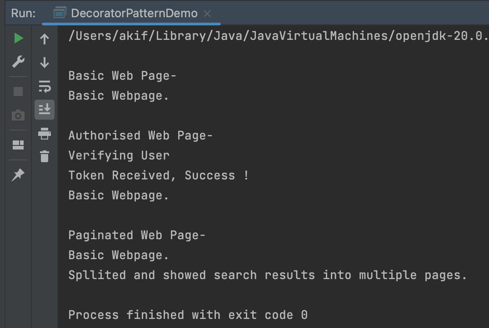

# A demonstration of Decorator Design Pattern

# Course Title : Object Oriented Design and Design Patterns Lab(CSE 4122)
## Author
Akif Islam 
Department of CSE, University of Rajshahi 
iamakifislam@gmail.com   

## Experiment 06

Write a Java program to demonstrate the implementation of a decorator pattern for a web page, which might display complex behavior, such as only allowing access to authorized users, or splitting search results across multiple pages

# N.B.
- I still have problems in understanding decorator pattern. I may add the class diagram later when I totally understand this pattern.
## Output

